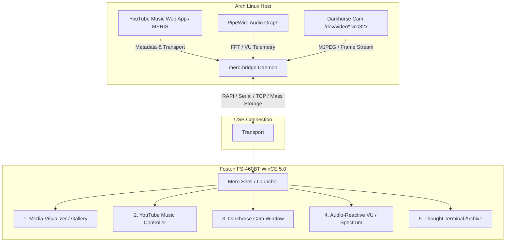

# Mero Monitor #2: Future Implementations & Architecture Roadmap
**Target Device**: Foston FS-460BT (MediaTek MT3351 ARM926EJ-S, 480×272 16bpp LCD, Windows CE 5.0 Core, 64MB RAM)  
**Host System**: Arch Linux (Kernel with custom V4L2 `vc032x` module, PipeWire audio graph, MPRIS D-Bus)

---

## 1. Executive Summary & Hardware Role
With autonomous boot (`HKLM\init\Launch50`), vendor UI bypass, cybernetic window management, and native process lifecycles verified, `mero-monitor-#2` transitions from a bare embedded recovery target into an active, dedicated cybernetic companion monitor.

Rather than running heavy client-side AI stacks or complex animation pipelines on an embedded ARM9 CPU, the device operates on a **split-plane architecture**:
* **Host (Linux Workstation)**: Heavy computing, network access, media telemetry, camera capture, audio FFT/energy analysis, and LLM reasoning.
* **Peripheral (WinCE Device)**: Lightweight, zero-latency, double-buffered local rendering, tactile touch control, and atmospheric visualization.

---

## 2. Architecture & Implementation Milestones

---

### Milestone 1: Atmospheric Media Visualizer (`mero-gallery.exe`)
* **Objective**: Transform the 480×272 display into a living picture frame and visual reference surface.
* **Core Capabilities**:
  * **Folder Selector**: Ability to select and switch between image folders on `\SDMMC` (e.g. `\SDMMC\Pictures`, `\SDMMC\Suzy`, `\SDMMC\Wallpapers`, `\SDMMC\Gallery`).
  * **Format Support**: Native uncompressed BMPs and self-contained decoding (JPEG, PNG, BMP) with zero external DLL dependencies.
  * **Touch Navigation**:
    * Tap Left Third: Previous image (`< PREV`).
    * Tap Right Third: Next image (`NEXT >`).
    * Tap Center: Toggle cybernetic On-Screen Display (HUD overlay).
    * Long Press: Pause / Resume slideshow.
  * **Configurable Slideshow**: Selectable transition intervals (3s, 5s, 10s, 30s, 60s, or Infinite/Manual).
  * **Rendering**: Aspect-ratio preserving letterbox or fill, double-buffered GDI BitBlt.
  * **Atmospheric Procedural Effects**: Optional overlay elements (subtle CRT scanline, timestamp, or audio reaction pulse).

---

### Milestone 2: YouTube Music Host Controller (`mero-media-ctrl.exe`)
* **Objective**: A tactile physical media deck on the desk displaying track metadata and controlling desktop playback.
* **Architecture**:
  * **Host Side**: Python / Rust bridge listening to D-Bus MPRIS (`org.mpris.MediaPlayer2.Player`) via `playerctl`.
    * Streams `Title`, `Artist`, `Album`, `ArtURL`, `PlaybackStatus`, `Position`, and `Duration`.
  * **Device Side**:
    * Large readable typography in high-contrast cyan/emerald palette.
    * Real-time progress bar (elapsed vs track duration).
    * Touch buttons: `[ |<< ]`, `[ PLAY / PAUSE ]`, `[ >>| ]`, `[ VOL - ]`, `[ VOL + ]`.
    * Passive mode: Acts as a dedicated miniature album sleeve when hands are on the instruments/keyboard.

---

### Milestone 3: Darkhorse Camera Live Monitor (`mero-cam.exe`)
* **Objective**: Dedicated surveillance and video monitor for the Vimicro VC0321/VC0323 Darkhorse webcam (`/home/zacmero/projects/old-cam`).
* **Architecture**:
  * Host captures V4L2 stream from `/dev/video*` via custom `vc032x` module.
  * Frames are downsampled to 480×272 16bpp (RGB565 or JPEG) on the workstation CPU.
  * Streamed over the USB interface at 10–15 FPS.
  * Device displays a low-latency CRT-style video feed with timestamp overlay.

---

### Milestone 4: Real-Time Audio-Reactive Visualizers (`mero-vis.exe`)
* **Objective**: Music-reactive visuals synchronized to studio playback or UR44 interface inputs.
* **Architecture**:
  * PipeWire monitor sink captures master playback audio without requiring microphone input.
  * Host performs lightweight FFT analysis and computes:
    * Peak Left / Right VU levels.
    * Sub-bass (20–80 Hz), Bass (80–250 Hz), Midrange (250–2000 Hz), Treble (2 kHz–16 kHz).
    * 16-band spectrum energy array.
  * Telemetry packet (under 64 bytes) sent at 20–30 Hz.
  * Device renders oversized stereo retro VU meters, spectrum waterfalls, or audio-pulsed sigils around artwork.

---

### Milestone 5: Thought Terminal (`mero-terminal.exe`)
* **Objective**: A calm, readable reflection display for saved agent thoughts, project logs, and philosophical prompts.
* **Capabilities**:
  * Reads local Markdown/plain-text reflection logs (`\SDMMC\MERO\reflections.txt`).
  * Paged reading with smooth typography, high-contrast monospace rendering, and date/source badges.
  * "Creative Prompt Deck" mode: Tap screen to draw a random studio / creative prompt.
